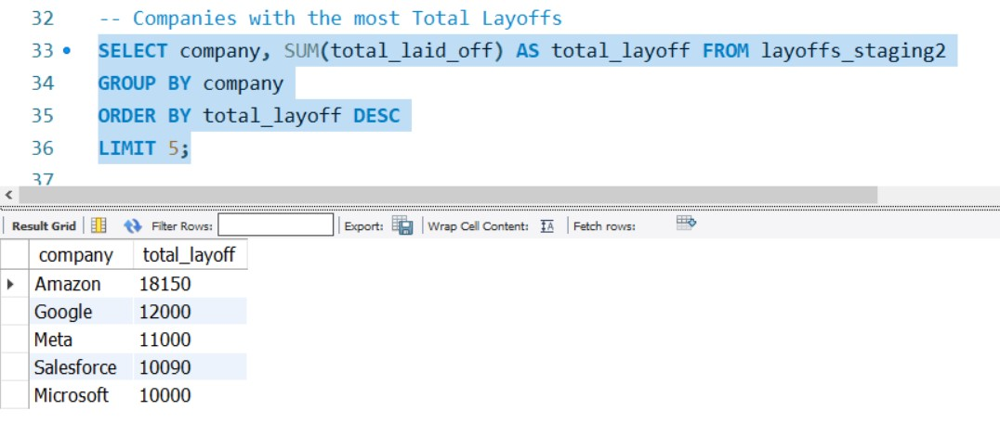

# 📊 SQL Layoffs Data Analysis Project


A complete SQL data cleaning and analysis project using MySQL to analyze global company layoffs from 2020-2023.

## 🎯 What This Project Does

This project takes messy, real-world layoffs data and cleans it up using SQL, then finds interesting patterns and insights about which companies, industries, and locations were most affected by layoffs.

## 📋 About the Data

**Source**: [Layoffs Dataset from Kaggle](https://www.kaggle.com/datasets/swaptr/layoffs-2022)

- **Size**: 2,300+ layoff records
- **Time**: 2020-2023
- **Coverage**: Companies worldwide
- **Industries**: Tech, Finance, Retail, Healthcare, and more


## 🧹 What I Did - Data Cleaning

### Step 1: Remove Duplicates

- Found and removed duplicate records
- Used SQL window functions to identify copies


### Step 2: Fix Data Problems

- Cleaned company names (removed extra spaces)
- Fixed industry names (made "Crypto" consistent)
- Fixed country names (removed dots from "United States.")
- Changed date format from text to proper dates


### Step 3: Handle Missing Data

- Filled in missing industry info when possible
- Removed records that had no useful layoff numbers


## 📊 Key Findings

### 🏢 Top 5 Companies with Most Layoffs


### 🌍 Top 5 Locations with Most Layoffs


### 🏭 Top 5 Industries with Most Layoffs


### 📈 Biggest Single Layoff Event


### 💔 Companies That Shut Down Completely (100% Layoffs)


## 🛠️ SQL Skills Used

- **Data Cleaning**: Removing duplicates, fixing messy data
- **Window Functions**: ROW_NUMBER(), RANK(), SUM() OVER()
- **Joins**: Connecting tables to fill missing data
- **Date Functions**: Converting text to dates
- **Aggregation**: GROUP BY, SUM(), COUNT(), MAX()
- **CTEs**: Common Table Expressions for complex queries


## 📁 Project Files

```
📦 layoffs-sql-analysis
├── 📄 README.md                  (This file)
├── 📂 data/
│   └── 📄 layoffs.csv            (Original dataset)
├── 📂 sql/
│   ├── 📄 data_cleaning.sql      (Cleaning queries)
│   └── 📄 eda.sql               (Analysis queries)
└── 📂 images/
    ├── 📷 top_companies.png      (Results screenshots)
    ├── 📷 top_locations.png
    ├── 📷 top_industries.png
    ├── 📷 max_layoffs.png
    └── 📷 complete_shutdowns.png
```


## 🚀 How to Run This Project

### What You Need

- MySQL installed on your computer
- MySQL Workbench (makes it easier)


### Steps

1. **Download** the files from this repository
2. **Open** MySQL Workbench
3. **Create** a new database called `world_layoff`
4. **Import** the `layoffs.csv` file as a table called `layoffs`
5. **Run** the `data_cleaning.sql` file first
6. **Run** the `eda.sql` file second to see the analysis

## 💡 What I Learned

- How to clean messy real-world data
- Advanced SQL techniques for data analysis
- Finding business insights from raw data
- Documenting and presenting data projects


## 🎓 Why This Project Matters

This project shows I can:

- ✅ Take messy data and make it clean and usable
- ✅ Write complex SQL queries to find insights
- ✅ Present findings in a clear, understandable way
- ✅ Work with real business data to solve problems


## 📞 Connect With Me

- **GitHub**: [sankaran-s2001](https://github.com/sankaran-s2001)
- **Looking for**: Data Science opportunities

***

*This project is part of my data science portfolio, showing my SQL skills and ability to work with real-world data.*

**Last Updated**: September 2025

***

## 📝 Quick Setup Note

Make sure your screenshots are saved in an `images/` folder in your repository with these names:

- `top_companies.png`
- `top_locations.png`
- `top_industries.png`
- `max_layoffs.png`
- `complete_shutdowns.png`

This README is now **beginner-friendly**, **short and crisp**, and will showcase your SQL project perfectly to potential employers!

